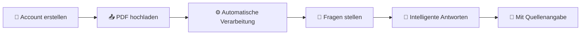
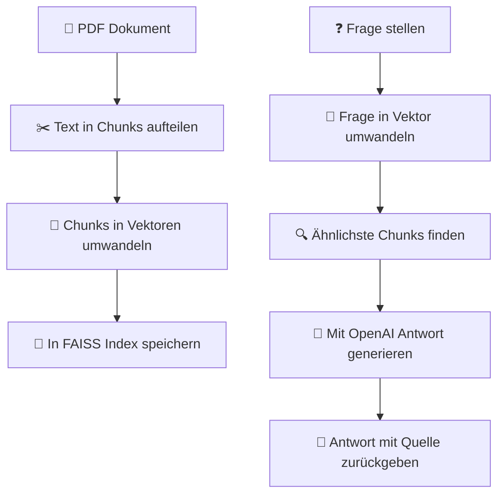

<div align="center">

# 🤖 AI PDF FAQ Bot

**Ein smarter Chatbot mit modernem Design, der deine PDF-Dokumente versteht und Fragen dazu beantwortet**

[](https://www.python.org/)
[](https://streamlit.io/)
[](LICENSE)

*Perfekt für AGBs, Verträge, Rechnungen oder Lebensläufe - einfach PDF hochladen und losfragen!*

[Features](#-features) • [Schnellstart](#-schnellstart) • [Screenshots](#-screenshots) • [Technologie](#-technologie)

---

</div>

## ✨ Features

<div align="center">

| 🎨 **Design** | 🚀 **Funktionalität** | 🔒 **Sicherheit** |
|:---:|:---:|:---:|
| Modernes UI mit Animationen | Intelligente PDF-Verarbeitung | Einfaches Login-System |
| Gradient-Hintergründe | Semantische Suche mit FAISS | Benutzer-spezifische Daten |
| Glassmorphism-Effekte | OpenAI GPT Integration | In-Memory Datenbank |
| Smooth Transitions | Quellenangaben | |

</div>

### 🎯 Hauptfunktionen

- 📄 **PDFs verstehen**: Automatische Textextraktion und Verarbeitung
- 🔍 **Intelligente Suche**: Semantische Suche mit FAISS für präzise Ergebnisse
- 💬 **Präzise Antworten**: Nutzt OpenAI GPT für natürliche, zusammenhängende Antworten (oder lokale Extraktion als Fallback)
- 📑 **Quellenangaben**: Zeigt immer an, aus welchem PDF und welcher Seite die Antwort stammt
- 🎨 **Modernes Design**: Hochwertiges UI mit Animationen, Gradienten und Glassmorphism
- 👤 **Einfaches Login**: Registrierung und Login ohne komplizierte Setup-Schritte
- ⚡ **Schnelle Verarbeitung**: Batch-Verarbeitung mehrerer PDFs mit Fortschrittsanzeige

---

## 🚀 Schnellstart

### 📋 Voraussetzungen

- Python 3.10 oder höher
- pip (Python Package Manager)
- (Optional) OpenAI API Key für bessere Antwortqualität

### 1️⃣ Installation

```bash
# Repository klonen
git clone <repository-url>
cd "AI PDF FAQ Bot"

# Virtuelle Umgebung erstellen
python3 -m venv venv
source venv/bin/activate  # Windows: venv\Scripts\activate

# Dependencies installieren
pip install -r requirements.txt
```

### 2️⃣ OpenAI API Key einrichten (Optional, aber empfohlen)

> 💡 **Tipp**: Für die besten Ergebnisse solltest du einen OpenAI API Key verwenden. Ohne Key funktioniert die App auch, aber die Antworten sind dann weniger präzise.

```bash
# .env Datei erstellen
cp .env.example .env
```

Dann öffne die `.env` Datei und trage deinen API Key ein:

```env
OPENAI_API_KEY=sk-dein-api-key-hier
OPENAI_MODEL=gpt-3.5-turbo  # oder gpt-4 für noch bessere Ergebnisse
```

**Wo bekomme ich einen API Key?**  
👉 Auf [platform.openai.com](https://platform.openai.com/api-keys) kannst du dir kostenlos einen erstellen. Die ersten **$5 Guthaben sind gratis**! 🎁

### 3️⃣ App starten

```bash
streamlit run app.py
```

Die App öffnet sich automatisch im Browser. Falls nicht, gehe zu `http://localhost:8501`

---

## 📸 Screenshots

<div align="center">

### 🎨 Modernes Design mit Animationen

Die App bietet ein hochwertiges, modernes Design mit:
- ✨ Gradient-Hintergründe
- 🎭 Smooth Animationen (Fade-in, Slide-in, Pulse)
- 💎 Glassmorphism-Effekte
- 🎯 Intuitive Benutzeroberfläche
- 📱 Responsive Layout

</div>

---

## 🎮 So funktioniert's

<div align="center">



</div>

### Schritt-für-Schritt

1. **🔐 Account erstellen**: Beim ersten Start einfach einen neuen Account anlegen
2. **📤 PDF hochladen**: Im Tab "PDFs hochladen" deine Dokumente auswählen und verarbeiten lassen
3. **💬 Fragen stellen**: Im Tab "Fragen stellen" einfach deine Frage eingeben
4. **✅ Antwort erhalten**: Der Bot sucht in deinen Dokumenten und gibt dir eine präzise Antwort mit Quellenangabe

### 💡 Beispiel-Fragen

<div align="center">

| 📝 Frage | 📄 Dokument |
|:---|:---|
| "Was ist meine Adresse?" | Lebenslauf, Vertrag |
| "Wie lautet meine E-Mail-Adresse?" | Lebenslauf, Bewerbung |
| "Was steht in den AGBs zur Rückgabe?" | AGBs, Geschäftsbedingungen |
| "Welche Position habe ich in meinem Lebenslauf?" | Lebenslauf |
| "Was sind die wichtigsten Punkte im Vertrag?" | Vertrag, Vereinbarung |

</div>

---

## 🛠️ Technologie

### 📦 Verwendete Technologien

<div align="center">

| Technologie | Verwendung | Version |
|:---|:---|:---:|
| **Streamlit** | Web-Interface mit modernem Design | ≥1.28.0 |
| **OpenAI GPT** | Intelligente Antwortgenerierung (optional) | ≥1.0.0 |
| **FAISS** | Schnelle semantische Suche | ≥1.7.4 |
| **Sentence Transformers** | Text-zu-Vektor Umwandlung | ≥2.2.2 |
| **PyPDF2** | PDF-Textextraktion | ≥3.0.1 |

</div>

### 🔬 Wie funktioniert die Suche?

<div align="center">



</div>

**Detaillierter Ablauf:**

1. 📄 Dein PDF wird in kleine Textabschnitte (Chunks) aufgeteilt
2. 🔢 Jeder Abschnitt wird mit Sentence Transformers in einen Vektor umgewandelt
3. 💾 Die Vektoren werden in einem FAISS-Index gespeichert
4. ❓ Wenn du eine Frage stellst, wird auch diese in einen Vektor umgewandelt
5. 🔍 Der Bot findet die ähnlichsten Abschnitte mit semantischer Suche
6. 🤖 Mit OpenAI wird daraus eine präzise Antwort generiert (oder lokal extrahiert)
7. 📑 Die Antwort wird mit Quellenangabe (PDF + Seite) zurückgegeben

### ⚙️ Konfiguration

In der `.env` Datei kannst du folgende Einstellungen vornehmen:

```env
# OpenAI (für bessere Antworten)
OPENAI_API_KEY=sk-dein-key
OPENAI_MODEL=gpt-3.5-turbo  # oder gpt-4

# Embedding Model (selten ändern nötig)
EMBEDDING_MODEL=sentence-transformers/all-MiniLM-L6-v2
```

---

## 📁 Projektstruktur

```
AI PDF FAQ Bot/
├── 📄 app.py                 # Hauptanwendung (Streamlit mit modernem Design)
├── ⚙️ config.py              # Konfiguration
├── 💾 database_dummy.py      # In-Memory Datenbank
├── 📂 models/
│   ├── 📄 pdf_processor.py   # PDF-Verarbeitung
│   └── 🔢 embeddings.py      # Embeddings & FAISS
├── 📂 services/
│   ├── 💬 qa_service.py      # Q&A Logik
│   └── 👤 user_service.py    # User Management
├── 📦 requirements.txt       # Python Packages
└── 📚 README.md             # Diese Datei
```

---

## ⚠️ Wichtige Hinweise

<div align="center">

| ℹ️ Hinweis | 📝 Details |
|:---|:---|
| **💾 Keine Datenbank nötig** | Alles läuft im Speicher. Beim Neustart gehen die Daten verloren, aber die FAISS-Indizes bleiben erhalten |
| **💰 Kosten** | Mit OpenAI API Key: ca. $0.002 pro Frage (GPT-3.5-turbo). Ohne API Key: **kostenlos**, aber weniger präzise |
| **🌐 Offline-Modus** | Die App funktioniert auch komplett offline (nach dem ersten Download der Modelle), wenn kein OpenAI Key verwendet wird |

</div>

---

## 🔧 Häufige Probleme

<details>
<summary><b>❓ App startet nicht?</b></summary>

- ✅ Prüfe, ob Python 3.10+ installiert ist: `python3 --version`
- ✅ Stelle sicher, dass alle Dependencies installiert sind: `pip install -r requirements.txt`
- ✅ Aktiviere die virtuelle Umgebung: `source venv/bin/activate`
</details>

<details>
<summary><b>📄 PDF wird nicht verarbeitet?</b></summary>

- ✅ Das PDF muss Text enthalten (nicht nur Bilder/Scans)
- ✅ Prüfe die Fehlermeldungen in der App
- ✅ Stelle sicher, dass das PDF nicht beschädigt ist
</details>

<details>
<summary><b>💬 Keine Antworten?</b></summary>

- ✅ Stelle sicher, dass PDFs hochgeladen wurden
- ✅ Formuliere deine Fragen präziser
- ✅ Prüfe, ob die Information wirklich im Dokument steht
- ✅ Versuche verschiedene Formulierungen
</details>

<details>
<summary><b>🔑 OpenAI Fehler?</b></summary>

- ✅ Prüfe, ob dein API Key korrekt in der `.env` Datei steht
- ✅ Stelle sicher, dass du noch Guthaben auf deinem OpenAI Account hast
- ✅ Die App fällt automatisch auf die lokale Methode zurück, falls OpenAI nicht verfügbar ist
</details>

---

## 🎨 Design-Features

Die App bietet ein hochwertiges, modernes Design mit folgenden Features:

- 🎨 **Gradient-Hintergründe**: Schöne Lila-Violett-Gradienten
- ✨ **Animationen**: Fade-in, Slide-in, Pulse-Effekte
- 💎 **Glassmorphism**: Transparente Container mit Blur-Effekten
- 🎯 **Hover-Effekte**: Interaktive Buttons und Cards
- 📱 **Responsive**: Funktioniert auf verschiedenen Bildschirmgrößen
- 🎭 **Smooth Transitions**: Flüssige Übergänge zwischen Zuständen
- 🎈 **Balloons**: Konfetti-Animationen bei Erfolg
- 📊 **Progress Bars**: Visuelle Fortschrittsanzeigen

---

## 📄 Lizenz

Dieses Projekt ist frei verfügbar für persönliche und kommerzielle Nutzung.

---

## 🙏 Credits

<div align="center">

| 🏢 Organisation | 📦 Beitrag |
|:---|:---|
| [HuggingFace](https://huggingface.co/) | Sentence Transformers |
| [Meta AI](https://ai.meta.com/) | FAISS |
| [Streamlit](https://streamlit.io/) | Framework |
| [OpenAI](https://openai.com/) | GPT-Modelle |

</div>

---

<div align="center">

### 💡 Tipp

Für den besten Start empfehle ich, einen **OpenAI API Key** zu verwenden. Die Antwortqualität ist damit deutlich besser und die Kosten sind minimal (ca. **2 Cent pro 1000 Fragen** mit GPT-3.5-turbo).

---

**⭐ Gefällt dir das Projekt? Dann gib ihm einen Star!**

Made with ❤️ and 🤖

</div>
